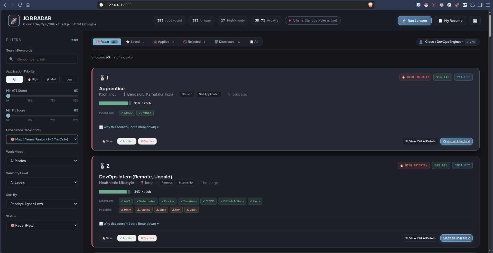
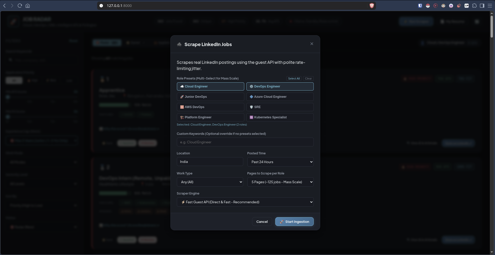
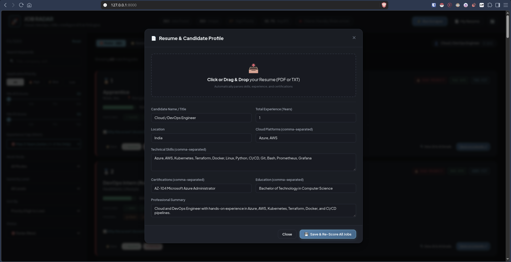

# jobfuk

Automated LinkedIn job scraper, resume matcher, and application tracking radar for Cloud, DevOps, and SRE roles.

Repo: https://github.com/pavan-srikar/jobfuk.git

---

## What It Does

1. **Scrapes LinkedIn**: Grabs job postings in bulk across multiple search pages without needing login credentials.
2. **Deduplicates Listings**: Merges duplicate multi-city postings from the same company into one clean card.
3. **Scores Every Job**: Compares job requirements against your resume using a deterministic scoring engine (and optional local Ollama AI).
4. **Filters Out Noise**: Automatically flags and penalizes jobs that demand 5–10+ years of experience or senior/lead titles if you are an early-career engineer.
5. **Tracks Applications**: Manages job lifecycle across Radar, Saved, Applied, Rejected, and Dismissed stages.

---

## Quick Start (For New Users)

### 1. Clone the repository
```bash
git clone https://github.com/pavan-srikar/jobfuk.git
cd jobfuk
```

### 2. Start the dashboard
```bash
./run.sh
```
*`run.sh` automatically creates a Python virtual environment and installs all dependencies on first run.*

### 3. Open in browser
Open your browser and navigate to:
```
http://127.0.0.1:8000
```

### 4. Load your resume
1. Click **My Resume** in the top navigation bar.
2. Click **Upload PDF Resume** and choose your `.pdf` resume file (or manually fill in your skills and experience).
3. Click **Save & Re-Score All Jobs**.

### 5. Scrape jobs
1. Click **Scrape Jobs** at top right.
2. Select your target roles (e.g. `DevOps Engineer`, `Cloud Engineer`).
3. Pick page count (1 to 5 pages) and click **Start Ingestion**.

---

## Screenshots

### Main Radar Feed


### Ingestion Scraper


### Resume Editor


---

## Setting Up Your Resume

When you first clone the repository, Job Radar loads a starter profile (`data/default_resume.json`). You can customize it with your own background in two ways:

### Method A: Upload your PDF (Recommended)
1. Click **My Resume** in the top right header.
2. Upload your PDF file. The parser will automatically extract:
   - Candidate name
   - Years of experience
   - Cloud platforms (AWS, Azure, GCP, etc.)
   - Technical skills (Kubernetes, Docker, Terraform, CI/CD, Linux, Python, etc.)
   - Certifications & Education
3. Review and fine-tune the parsed fields.
4. Click **Save & Re-Score All Jobs**.

### Method B: Manual Form or JSON
- **Via Web UI**: Open **My Resume**, edit the fields directly in the form, and hit **Save & Re-Score**.
- **Via JSON File**: Edit `data/resume.json` directly with your details.

---

## How It Works

```
LinkedIn Search ──► HTML Parser ──► Deduplication ──► Scoring Engine ──► SQLite DB ──► Dashboard UI
                                                            │
                                                     Your Resume Profile
```

### 1. Scraping
- **Web UI**: Click **Scrape Jobs** in the top bar, choose role presets, select page depth, and click **Start Ingestion**.
- **CLI (Terminal)**: Run scraper directly from terminal:
  ```bash
  ./venv/bin/python app/scraper/mass_scraper.py --presets "DevOps Engineer" "Cloud Engineer" --pages 3 --location "India"
  ```
  Or scrape all presets at once:
  ```bash
  ./venv/bin/python app/scraper/mass_scraper.py --all-presets --pages 5
  ```

### 2. Scoring System
Every job receives two scores (0 to 100):

| Metric | Description |
| :--- | :--- |
| **ATS Score** | Skill alignment between your resume and the job description (skills, cloud stack, certs, keywords). |
| **FIT Score** | Practical match based on your experience level versus stated requirements. |
| **Priority** | **HIGH** (strong match, apply immediately), **MEDIUM** (good fit), or **LOW** (weak fit or overqualified requirements). |

#### Hard Constraints & Penalties
- **Experience Penalty**: Severe score reduction if a job requires more experience than your resume profile.
- **Seniority Flags**: Automatic blocker warnings on `Senior`, `Lead`, `Principal`, or `Architect` titles if you are junior.
- **Reposted Tag**: Shows a red `🚨 Reposted` badge if the company relisted the posting.

### 3. Application Lifecycle
Jobs move through 5 distinct states:
- **🎯 Radar**: Fresh unreviewed jobs.
- **⭐ Saved**: Bookmarked jobs you want to review.
- **💼 Applied**: Jobs where you submitted an application.
- **🚫 Rejected**: Jobs where the application was rejected (only accessible from Applied).
- **🗑️ Dismissed**: Ignored or irrelevant jobs.

---

## Project Structure

```
jobfuk/
├── app/
│   ├── config.py             # App configuration and preset roles
│   ├── database.py           # SQLite schema, queries, and deduplication engine
│   ├── main.py               # FastAPI backend and API routes
│   ├── parser/               # Resume PDF parser and extractor
│   ├── scorer/               # Rule-based and AI hybrid scoring engine
│   ├── scraper/              # LinkedIn scraper and CLI mass scraper
│   └── static/               # Dashboard frontend (HTML, CSS, JS)
├── data/
│   ├── default_resume.json   # Base resume template
│   └── jobs.db               # SQLite database (auto-generated on boot)
├── docs/                     # Documentation & UI screenshots
├── tests/                    # Automated flow and verification tests
├── requirements.txt          # Python dependencies
├── run.sh                    # One-click startup script
└── README.md
```

---

## Tech Stack

- **Backend**: Python 3.10+, FastAPI, Uvicorn, SQLite
- **Scraper**: Requests, BeautifulSoup4
- **Scoring**: Deterministic rule-based matcher + optional local Ollama LLM
- **Frontend**: Vanilla HTML5, CSS3, JavaScript (no node_modules required)
- **Document Processing**: PyPDF
